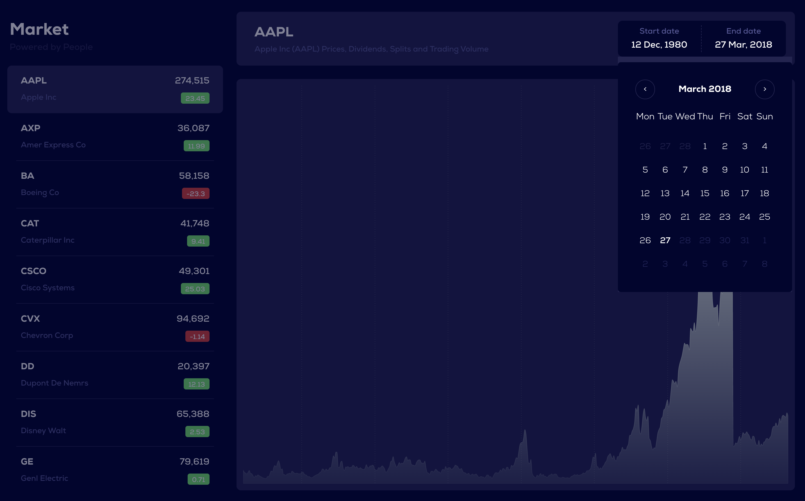
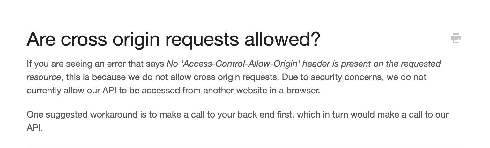

###

## Stocks By People
#### [Live Stock by People  Demo ](https://powered-stocks.netlify.app/)
 

[](https://github.com/toelapiut/Powered-Stock/blob/develop/LICENSE)
[](https://GitHub.com/toelapiut)




## Getting Started
This project provides a stock market environment using [Quandl](https://quandl.com) api to IPO stock data for free.

### Prerequisites
Just before you jump to the project get the environments right.

```
node v12.16.1 and above
package-manager(yarn or npm)
```

### Installing

After creating the Prerequisites ready to clone the project

First, clone powered project using http and ssh respectively

```
$ git clone git@github.com:toelapiut/Powered-Stock.git powered
$ git clone https://github.com/toelapiut/Powered-Stock.git powered
```

Then enter into the powered directory and install the packages using your favourite package-manager ```yarn``` or 
```npm``` whichever you are comfortable in.

### Running code locally:
For you to successfully run your code locally you'll need to have an .env file at the root directory with the following variables:
```dotenv
REACT_APP_BASE_URL=https://powered-market.herokuapp.com/api/v1/quandl/ #just for testing purposes 
SKIP_PREFLIGHT_CHECK=true
REACT_APP_VERSION=$npm_package_version
REACT_APP_NAME=$npm_package_name
```

After which you can run the command 

```
$ yarn start
$ yarn test:watch
$ yarn test:coverage
```

or 

```
$ npm run start
$ npm run test:watch
$ npm run test:coverage
```

## Challenge
 During development of the application, I encountered a couple of errors that I managed to fix. However, one error that 
 that stood out for me was the CORS error from quandl API. After hours and hours of research I finally found out that the 
 error was with Quandl API. Quandl doesnt allow Cross Origin resource sharing  as stated [**here**](https://help.quandl.com/article/368-are-cross-origin-requests-allowed).
 The only way around that CORS error was to build a backend to wrap Quandl API and serve my front-end with that data.
 Here is the link to my [**Powered Backend**](https://github.com/toelapiut/powered-backend)
 
 ***FAQ response from Quandle regarding CORS***
 


**NOTE:** Keep that in mind
## Built With:

* [Reactjs](https://reactjs.org/) - React makes it painless to create interactive UIs
* [SWR](https://swr.vercel.app/) -SWR  is tool to help you optimise and simplify the logic of data fetching in your project
* [Tailwind CSS](https://tailwindcss.com/) - A utility-first CSS framework packed with classes like flex, pt-4, text-center and rotate-90 that can be composed to build any design, directly in your markup.
* [VISX](https://airbnb.io/visx) - visx a collection of expressive, low-level visualization primitives for React
* [Enzyme](https://enzymejs.github.io/enzyme/) -Enzyme is a JavaScript Testing utility for React that makes it easier to test your React Components' output.
* [Yarn](https://yarnpkg.com/) - Yarn is a package manager that doubles down as project manager. 

## Contributing

Please read CONTRIBUTING for details on our code of conduct, and the process for submitting pull requests to us.


## Authors

* **[Apiut Toel](https://github.com/toelapiut)**


## License

This project is licensed under the MIT License - see the [LICENSE.md](LICENSE) file for details

## Acknowledgments

* Apple Stock
* Airbnb for VISX
* Hat tip to anyone whose code was used


